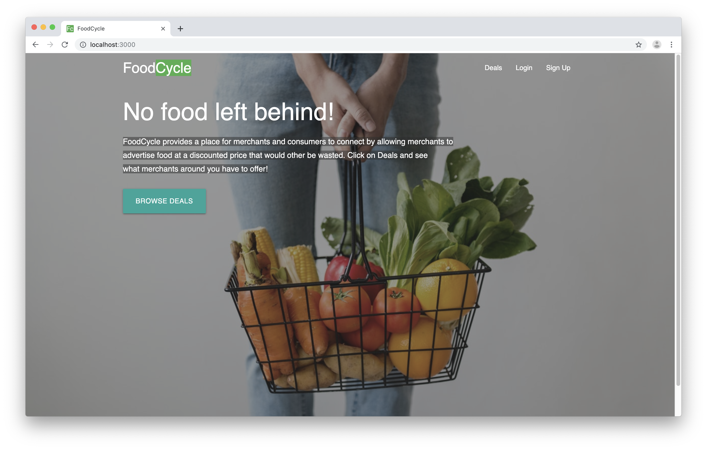
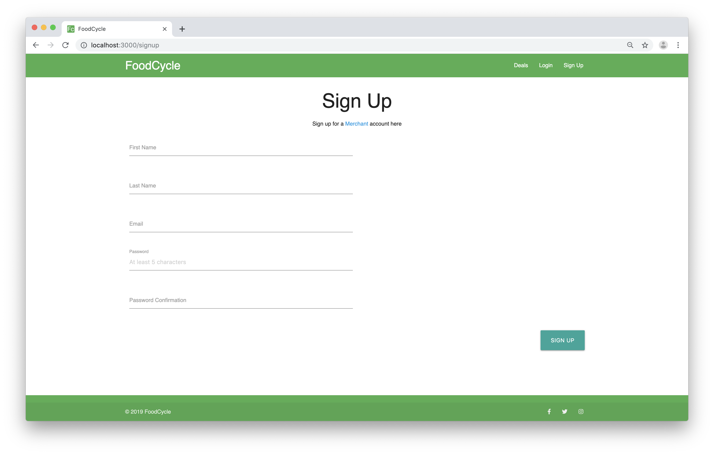
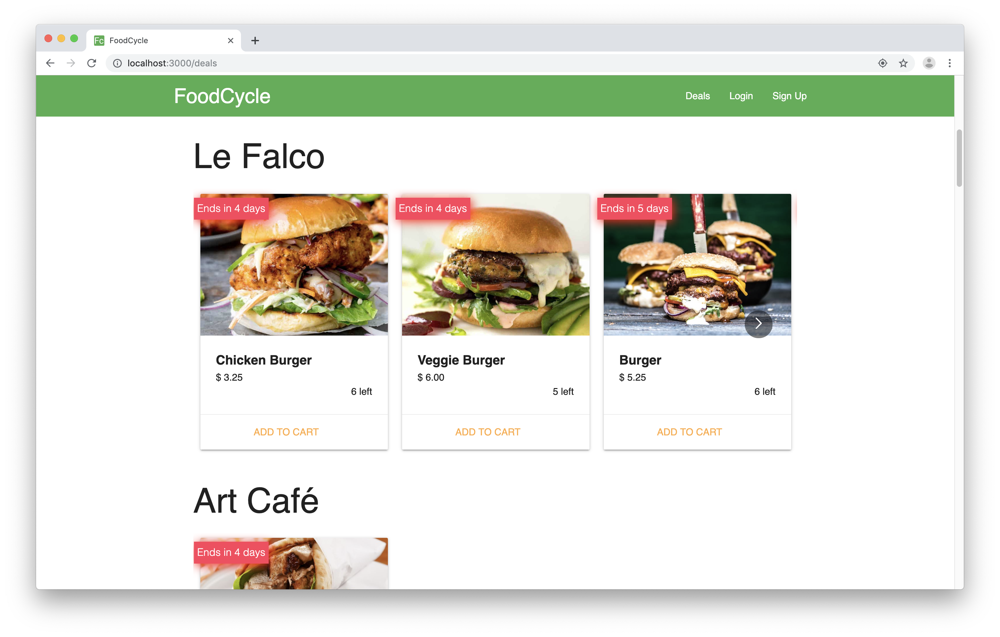
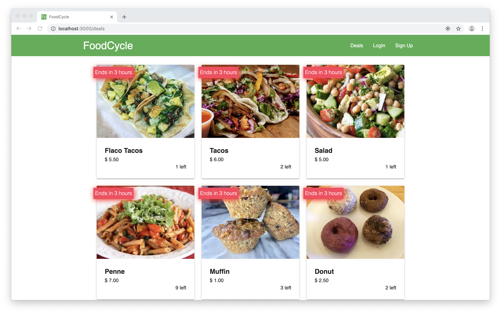
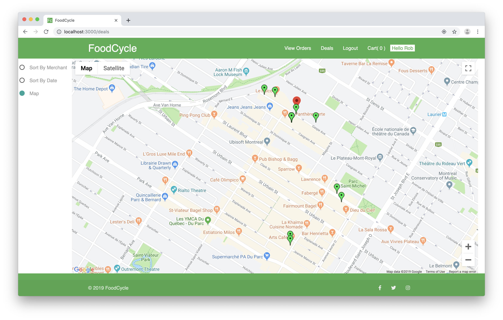
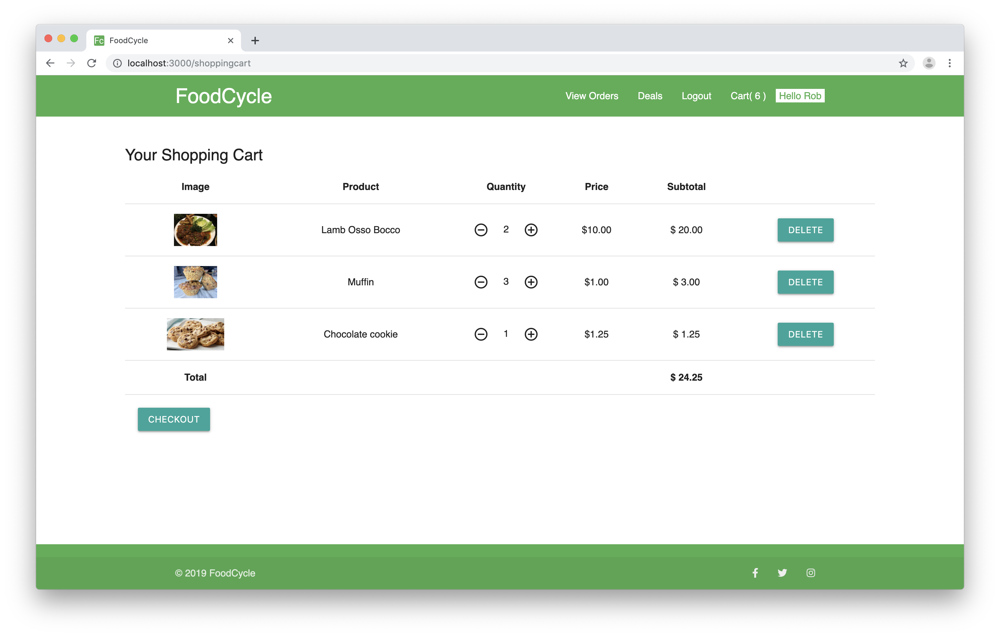
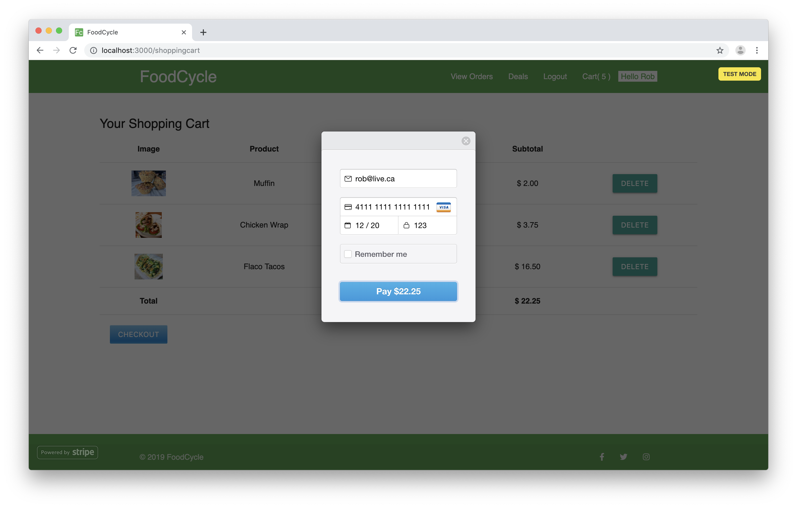
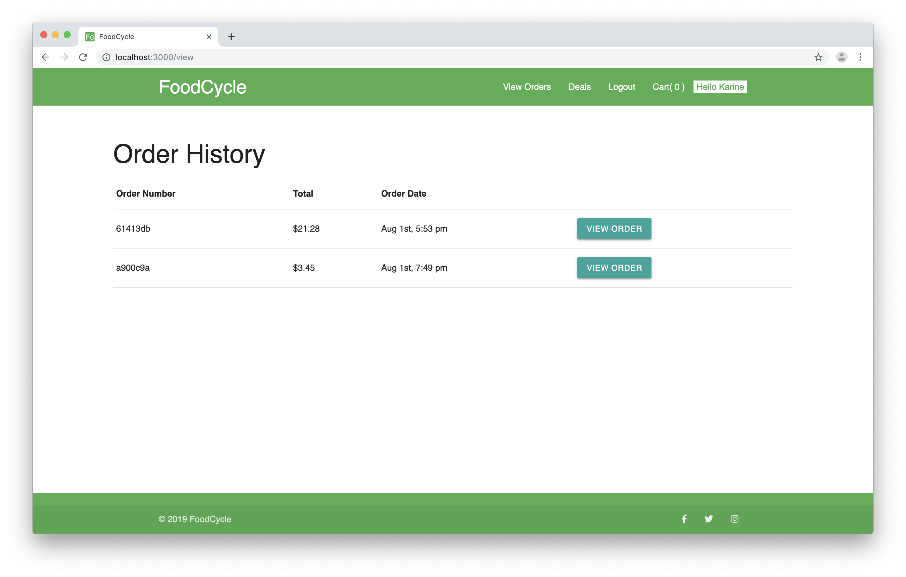
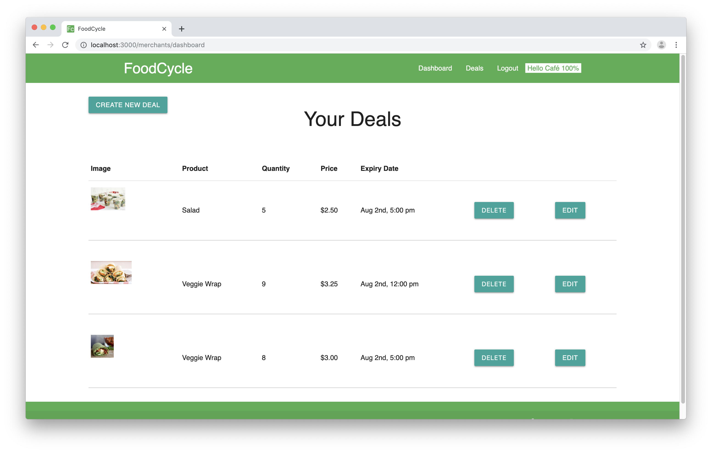

# FoodCycle

FoodCycle is an application that allows merchants to post an add for food that remains at the end of the day or week that would otherwise be thrown out. The merchant is then able to recuperate some lost revenue by selling these remaining items at a discount. Users of the app can browse deals in their area and pay for them directly on the site, then simply pick them up before the end of the day.

The project team consists of [Karine Seguin](https://github.com/karineseguin22), [Yu Liang](https://github.com/keefu), [Saad Hafa](https://github.com/leboss125) & [Fred Lavoie](https://github.com/FredLavoie).

### Front-end:
The html content is rendered on the client side using the [ReactJS](https://reactjs.org/) framework/library. React allow the developer to create the interactive parts of the app in JavaScript and render the html  needed as well as change the html elements quickly making the application dynamic.

Using a front-end framework called [Materialize](https://materializecss.com/), the application has a modern and responsive look that users expect. The application also makes use of [Sass](https://sass-lang.com/) to give additional style customization to the content. 

### Back-end:
The back-end server is built using [node.js](https://nodejs.org) and [Express.js](https://expressjs.com/) - a node.js framework. The back-ened serves as an API to the front end while the front-end does the navigation by rendering the various components.

## Screenshot

### Home page


### Signup page


### Deals page sorted by merchant


### Deals page sorted by expiry date


### Map view showing merchants


### Shopping cart


### Checkout


### Order history


### Merchant dashboard



## Getting started
- clone repository to your local machine
- create a ```.env``` file as per ```.env.example``` and fill out the information required
- in terminal, run ```knex migrate:latest``` in the 'backend' directory
- in terminal, run ```knex seed:run``` in the 'backend' directory
- in terminal, run ```npm install``` and then ```npm start``` in the 'client' directory
- in terminal, run ```npm install``` and then ```npm run dev``` in the 'backend' directory
- navigate to ```localhost:3000``` in your browser

## Dependencies

- [express](https://www.npmjs.com/package/express)
- [PostgreSQL 9.x](https://www.postgresql.org/)
- [react](https://www.npmjs.com/package/react)
- [react-dom](https://www.npmjs.com/package/react-dom)
- [react-router-dom](https://www.npmjs.com/package/react-router-dom)
- [materialize-css](https://www.npmjs.com/package/materialize-css)
- [firebase](https://www.npmjs.com/package/firebase)
- [react-firebase-file-uploader](https://www.npmjs.com/package/react-firebase-file-uploader)
- [google-maps-react](https://www.npmjs.com/package/google-maps-react)
- [react-stripe-checkout](https://www.npmjs.com/package/react-stripe-checkout)
- [react-multi-carousel](https://www.npmjs.com/package/react-multi-carousel)
- [moment](https://www.npmjs.com/package/moment)
- [lodash](https://www.npmjs.com/package/lodash)
- [react-confetti](https://www.npmjs.com/package/react-confetti)


